# Lab: Spatial Aggregation and Toxic Release Inventory Data

## Introduction

In this lab, you will aggregate point data based on polygons from another data layer. Using the aggregated data, you will perform a basic analysis of the data, allowing you to map the density of toxic release inventory (TRI) sites within each census tract in Los Angeles County.

## Data

### Download

Data for this lab can be downloaded from this Github repository by cloning the entire repository or by downloading the [compressed data file](https://github.com/kaymmm/intro-to-gis-demo/blob/master/data/TRI.zip?raw=true).

### Data Descriptions

| Filename | Description | Source |
|----------|-------------|--------|
| 2010_Census-Tracts.shp | 2010 US Census Tract boundaries for Los Angeles County. Joined with 2009-2014 ACS household income data (see below). | [US Census](https://www.census.gov/geo/maps-data/data/tiger-line.html) |
| ACS_14_5YR_S1903* | 2009-2014 5-year American Community Survey median household income data, table S1903, for Los Angeles County, along with its metadata | [American Fact Finder](http://factfinder.census.gov/faces/nav/jsf/pages/download_center.xhtml) |
| LAC-TRI.shp | TRI Facilities located within LA County. | (reduced set computed from CSV, removed some columns for size) |
| Census_Tracts-TRI.shp | LA County Census tracts spatially joined with TRI facilities | (computed from other data) |
| STATE_SINGLE_CA.CSV | TRI Facilites in California (see metadata for more info) | [EPA Envirofacts](http://www.epa.gov/enviro/epa-frs-facilities-state-single-file-csv-download) |
| Facility State File Documentation.pdf | TRI Facility Metadata | [EPA Envirofacts](http://www.epa.gov/enviro/epa-frs-facilities-state-single-file-csv-download) |

## Procedure

### 1. Getting Started

  a. Start ArcGIS and create a new blank map:

  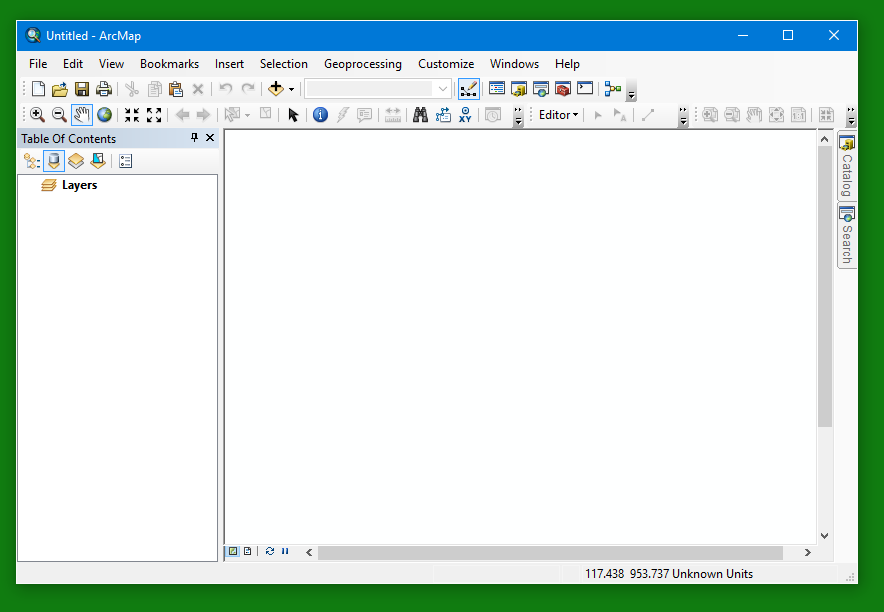

  b. Load Census Tracts and TRI Facility data. Click on the `Add Data` button:

  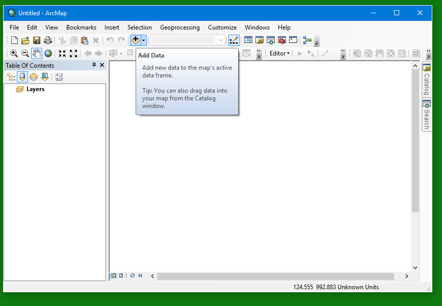

  Navigate to the folder where you unzipped the downloaded data and then hold the `control` key while clicking on the `2010_Census-Tracts.shp` and `LAC-TRI.shp` files:

  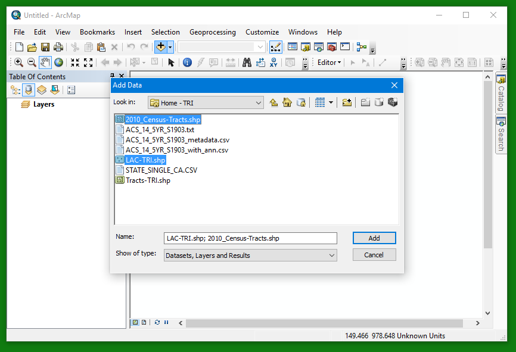

  c. Take a moment to open the attribute table (right click on the layer name and select `Open Attribute Table`) for each of the layers you just loaded and explore the data columns. Refer back to the metadata for these two datasets for more information about what each column represents (the metadata names are listed in the table above). Try to gain a basic understanding of what underlying phenomena the two datasets represent.

### 2. Perform the Spatial Aggregation

  d. Now you are going to aggregate the TRI facilities by Census tracts. In non-GIS terms, this means, for each Census tract, find all of the TRI facilities located within the tract, and attach a data summary to that Census tract. Since the TRI dataset only contains descriptive information, the data summary you calculate will only be the total count of TRI facilities.

  Right click on the layer containing Census tracts and select `Joins and Relates > Join...`:

  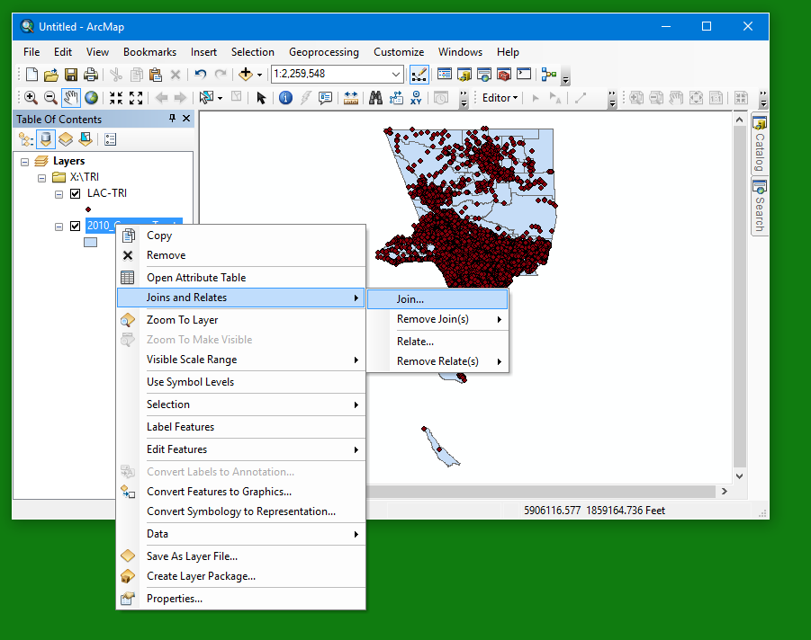

  > **Extra Challenge:** Download TRI release data by facility from the [EPA Envirofacts website](http://www.epa.gov/enviro/epa-frs-facilities-state-single-file-csv-download) and perform an aggregation by Census tracts, but instead of just calculating the facility count, calculate statistics on the releases. For this data to be meaningful, it might be helpful to filter the data based on chemicals since different chemicals have different toxicity characteristics at different concentrations and they can't all be compared on an equal basis.

  e. In the window that appears, you want to select `Join data from another location based on *spatial location*`. For the options, select 1. `LAC-TRI`, 2. (the first option) 3. Click the folder icon and pick a happy place to save the new layer, like the same directory containing the rest of your data.

  **Important:** Do **NOT** click the `OK` button. This spatial join will take several minutes to process. If you were working with your own data sets, you would click `OK` then go off to get a cup of coffee. Due to time constraints, I have provided you with a data layer that contains the results of this operation. Load that instead and save yourself from staring at the screen trying to use the force to make the progress bar move faster.

  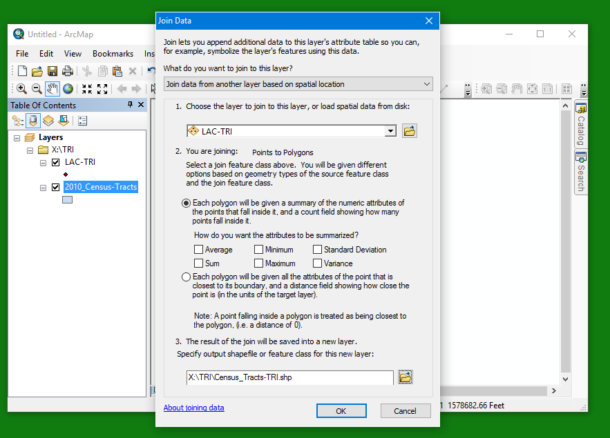

  f. Since we cheated the last step, load the pre-joined data by clicking the `Add Data` button and selecting `Census_tracts-TRI.shp`. Once the layer loads, right click on the layer name and open the attributes table:

  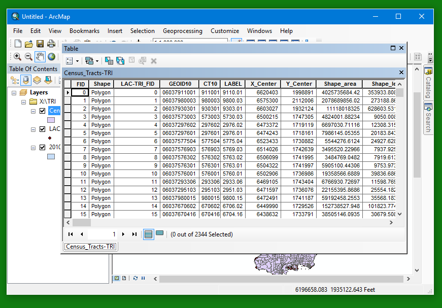

  g. Inspect the new data layer. Notice the new column at the end, `Count_`. This is the count of TRI facilites in each Census tract. Any other statistical summaries you perform on the aggregated data would appear here as well (e.g., mean, median, variance, etc.). Feel free to give this column a more meaningful alias, such as "Number of TRI Facilities". Once you're satisfied that this data is really what I claim, close the attributes table.

### 3. Classify Census Tracts According to TRI Facilities

  h. Now let's see if we can showcase our aggregated data in a meaningful way by classifying the Census tracts based on the number of TRI facilities. Double click on the Census_Tracts-TRI layer to open the Properties window, the click on the `Symbology` tab. In the `Show` panel, select `Quantities > Graduated colors`. In the `Fields` panel, select the column representing the TRI count (if you didn't rename it, it's called `Count_`).  In the `Classification` panel, you can select any of the classification schemes, or leave it at the default, `Natural Breaks (Jenks)`, and select `5` classes. Finally, select a color ramp that you think will visually convey the meaning of the different. I chose the aesthetically ugly "sledgehammer" traffic signal color ramp; you might be more judicious:

  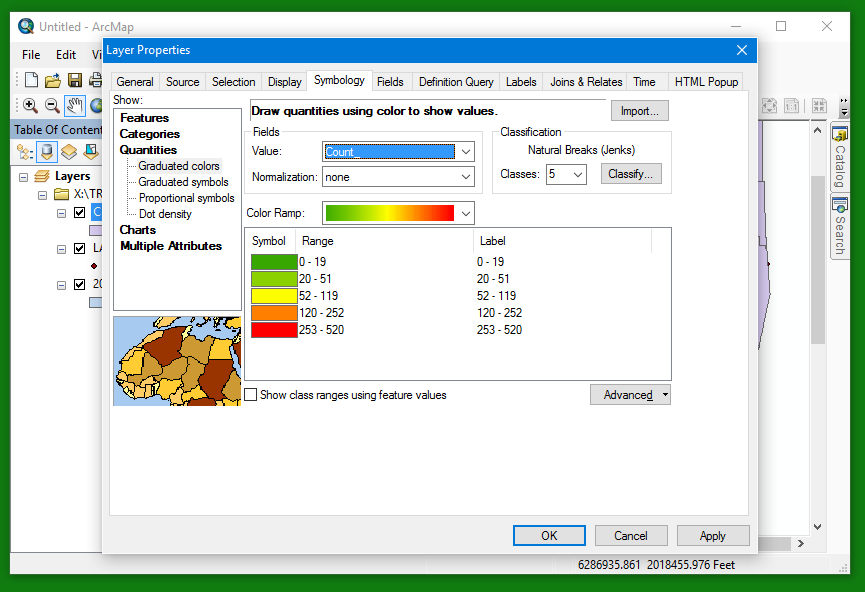

  i. Inspect the resulting map. What do you see? Any really obvious patterns stick out? I can identify at least two really obvious patterns...

  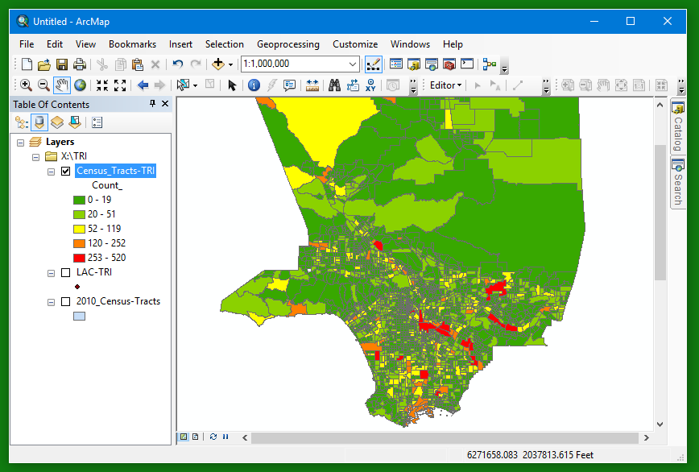

  j. In addition to some spatial clustering, did you also notice that higher TRI facility counts seem to be more prevalent in larger (areal) census tracts? We should probably normalize our data to account for the size of census tracts. At the very least, it will give us another set of data to compare against.

### 4. Classify Census Tracts According to TRI Facility Density

  k. Next you will calculate the TRI facility density within each Census tract. To do this, we first need to calculate the area of the Census tracts. Open the `Attributes Table` for the `Census_Tracts-TRI` layer, click the `Table Options` button in the upper left corner and select `Add Field...`:

  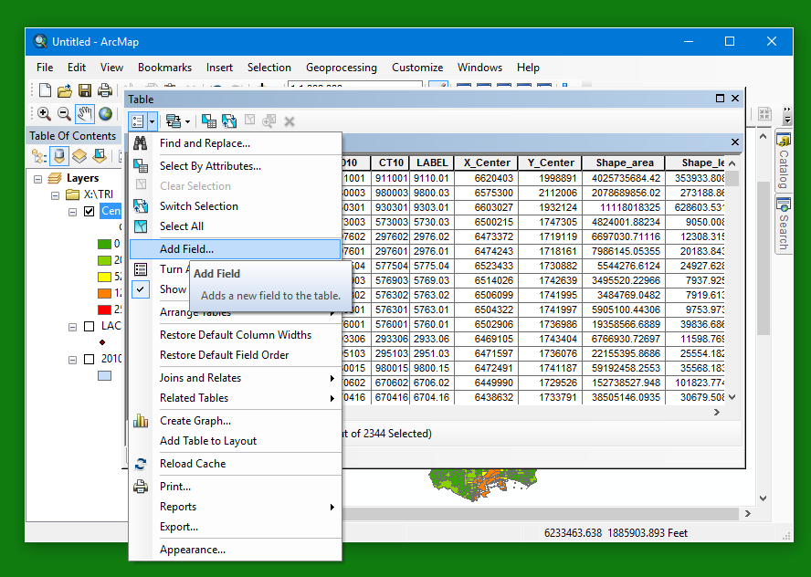

  Give the new field a meaningful name like `Area_km2` (indicating it will be in square kilometers) and be sure to select `float` as the data type:

  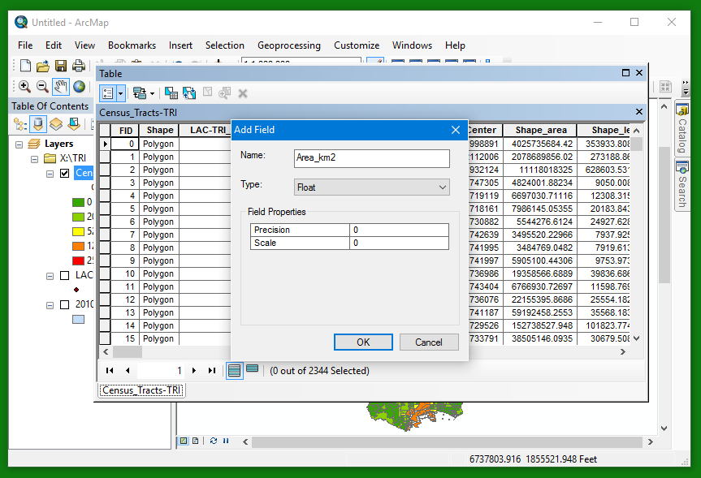

  Scroll to the far right of the attributes table and right click on your new field's heading, then select `Calculate Geometry`:

  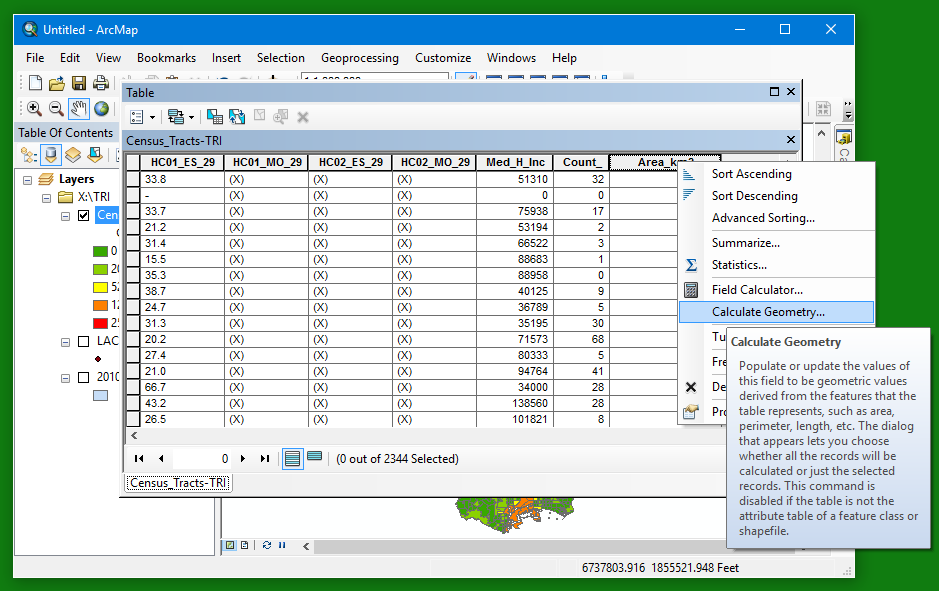

  Select `Area` for the `Property`, keep the existing projection, and select `Square Kilometers` for the `Units` property:

  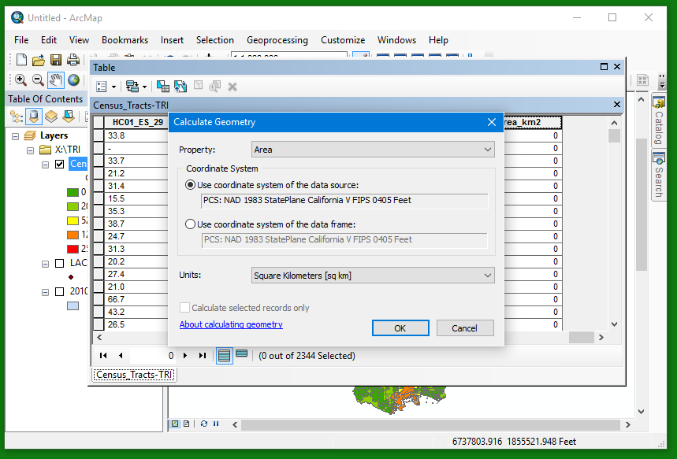

  l. Now that you have your Census tract areas, you can calculate the density as the number of TRI facilities divided by the area, yielding TRI facilities per square kilometer. Repeat the above steps for another new field (I called it `TRI_Dens`, be sure to use `float` data type), but instead of using the `Calculate Geometry` function, use the `Field Calculator`:

  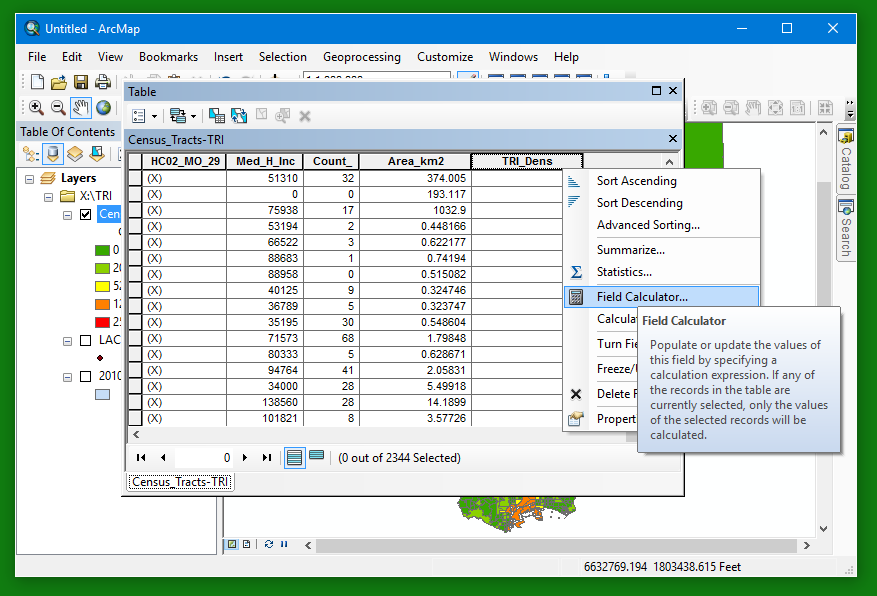 

  In the field calculator, enter a formula to divide the `Count_` field by the `Area_km2` field (your field names may differ): `[Count_] / [Area_km2]`

  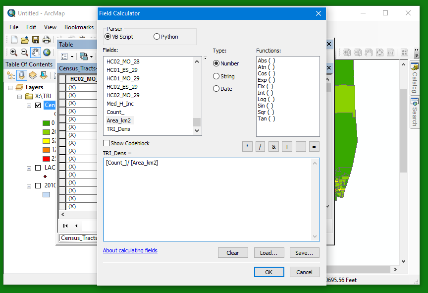

  >Note: In some GIS programs, the area calculation doesn't automatically convert to the desired units, so you might need to manually convert, e.g., feet^2 to km^2, either in the area field itself or in the density calculation.

  m. Finally, you can close the attributes table and adjust the symbology of your `Census_Tracts-TRI` layer to disply your density data (Note: I changed the classification scheme to quantiles in my screenshot):

  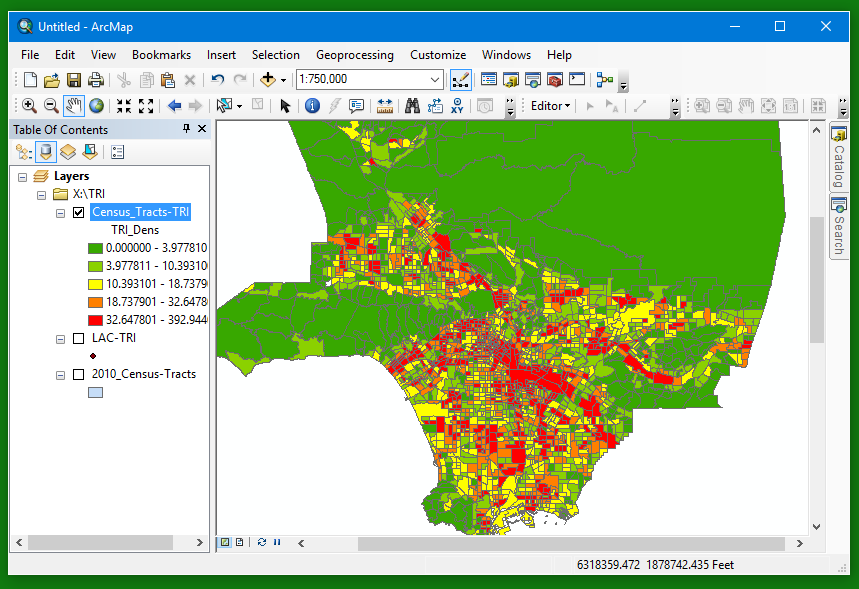

  n. Notice the difference? If you want to compare the TRI facility density with the TRI facility count, you could duplicate the layer and symbolize accordingly.

### 5. Next Steps

  o. So what about all of that additional data that is included with the Census Tracts? To get you started on further explorations of these data, I included median household income data taken from the American Community Survey. You could compare the TRI facility density map with a similar map of median household incomes (aggregated by Census tracts, of course). What if you wanted to compare the TRI facility density data to racial and ethnic compositions of the Census tracts? How would you go about that?

  p. The observations you can make about the coincidence of TRI facilities with lower-income areas based on these maps are *descriptive*, but not *quantifiable*. However, now that you've completed the first step of aggregating data, you are all set to begin more advanced spatial analysis techniques involving spatial statistics! 

## Discussion questions
- What do you think the presence of TRI facilities in a Census tract means for the populations that live within that tract? 
- What might be some policy implications of the data you mapped?
- What issues related to data aggregation do we need to consider before publishing these data or performing additional qualitative or quantitative analyses of these data?
- What are some other ways that we might have aggregated these data to relate TRI facilities to underlying populations?
