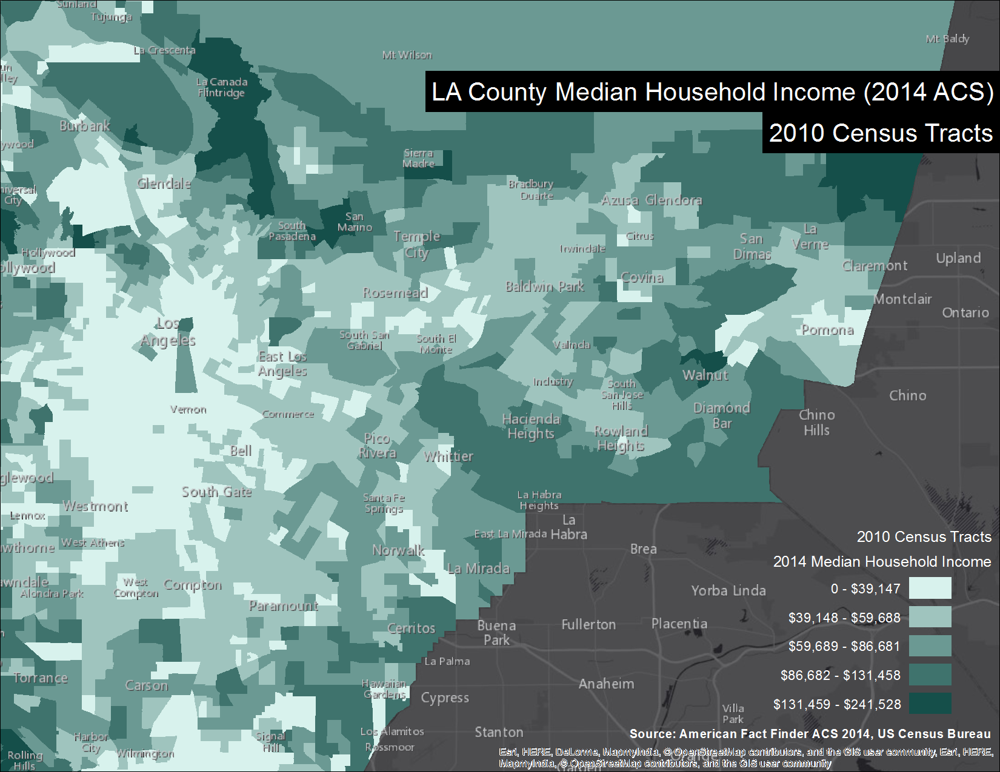
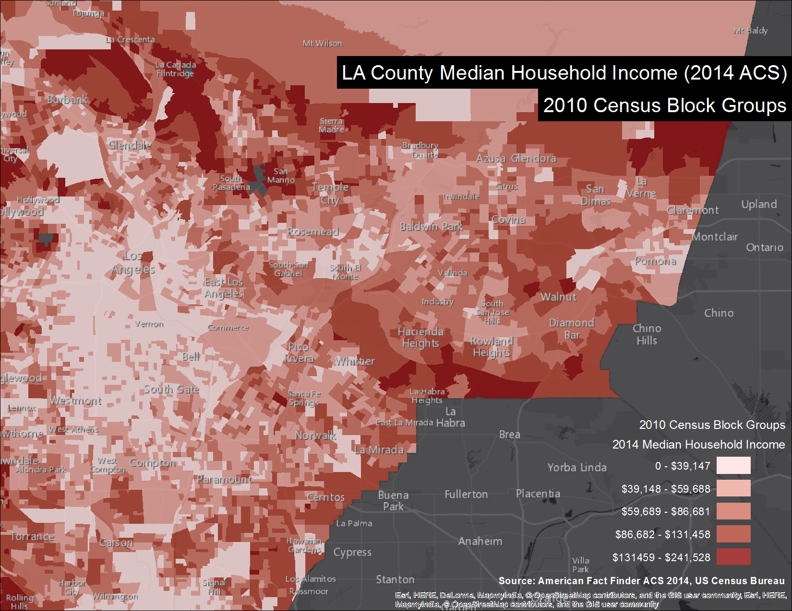
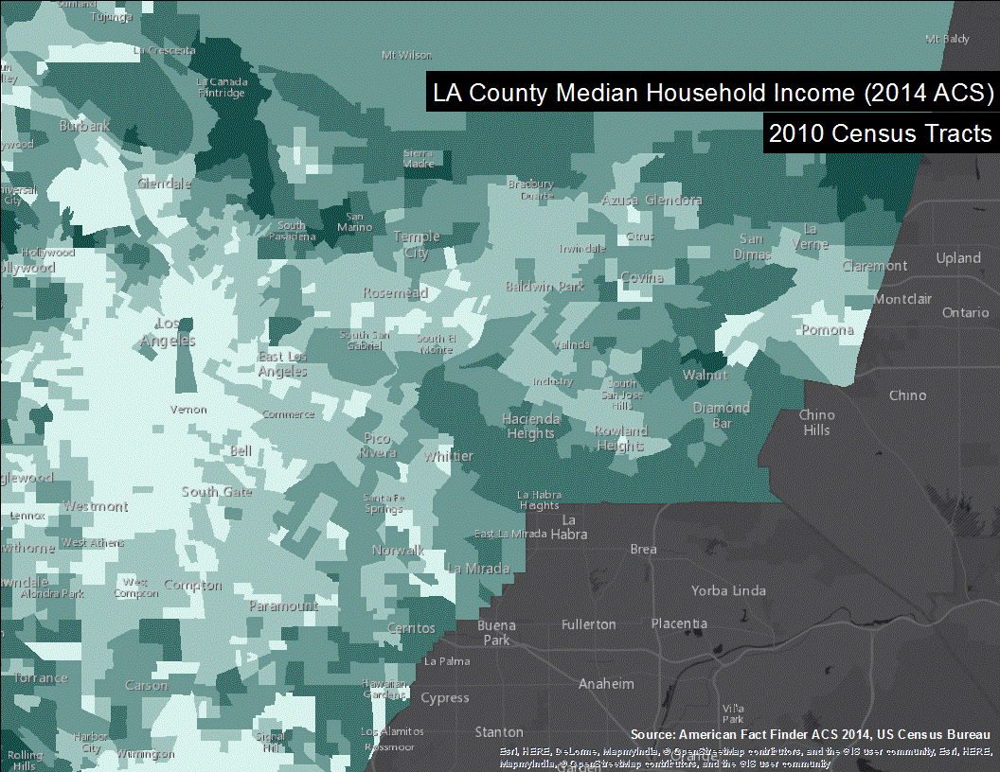
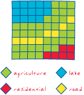

# Spatial Data Aggregation: or Better Ways to Gerrymander Using GIS

This teaching demonstration explores the Geographic Information Science technique of spatial data aggregation. Spatial data aggregation is the process through which discrete spatial data points, things like locations of bee colonies or the places where people live, are grouped together based on their proximity, to allow underlying patterns to be discerned and to facilitate statistical analyses. Gerrymandering, or the deliberate manipulation of electoral district boundaries to control voting outcomes, highlights one of the ways that different methods of spatial aggregation can affect results. This hands-on teaching demonstration will introduce methods of spatial aggregation, as well as the problems, limitations, and implications of using spatial aggregation, not just with voting and population data, but for all types of spatial data.

# Learning Objectives

- Students will understand the function and purpose of spatial aggregation
- Students will be able to perform point-to-polygon spatial aggregation
- Students will be able to compose a choropleth map using spatial aggregation and basic spatial analysis
- Students will understand the two forms of the modifiable areal unit problem and how they relate GIS techniques to underlying phenomena

# Introduction

**Key questions to consider**
- What is a unit of aggregation?
- What is their purpose in a GIS system?
- What are some potential problems that we need to consider when aggregating data?

>Example: You are trying to characterize the degree and extent of a natural gas leak from a hypothetical underground storage facility in Porter Ranch. Using a portable handheld measurement device (e.g., flame ionization detector), you and your team collect several hundred ambient air samples (with locational information) near and far from the source of the leak.
>Take 5 minutes to brainstorm ideas for how you would try to analyze these data. What types of information might be useful? Are there ways of organizing the data to make the data easier to work with?

In GIS systems, it is often necessary to summarize data over an area so that you can summarize the data, perform statistical analyses, and compare the data with other datasets. With sensitive datasets like those involving health or human populations, summarizing data is often an important step in ensuring the privacy of participants. One of the most common techniques for accomplishing this is spatial aggregation.

**Definition:** Spatial data aggregation is the process of combining data across one or more datasets using spatial information and/or other variables to group or classify the data. It is also used to transform data from a finer to coarser scale.

>Example: You might want to group your FID data by distance from the leak’s origin by establishing aggregation units as concentric “donuts” (annuli), characterized by statistical summaries of the points contained within each donut. Another approach might be to group data by similar values. Yet another approach might be to establish a uniform grid overlaying the entire study area. If you are combining this data with, say, Census data to see how populations are affected, you might aggregate data points by Census tracts.

The selection of an aggregation unit depends on myriad factors, such as what the data represent, how the data were collected, what types of analyses will be performed, what types of inferences will be made from the analyses, preexisting aggregation units (e.g., congressional districts), underlying patterns in the data, and data density.

# Spatial Aggregation Methods

For each method, think about how you might implement that method in GIS in terms of layers, joins, intersections, etc., as well as why you might want to perform such an operation.

## Point-to-Point (simple categorical join)

Individual data points that meet specific criteria are aggregated or assigned to another point. An example might be bees observed within a field that are assigned to a given hive based on their colony; another might be stop-and-frisk incidents and police departments.

>Does it matter if points from one group intersect points from another group?

## Point-to-Polygon (simple spatial join)

Probably the most common form of spatial aggregation. Individual data points are grouped into polygons based on proximity or their spatial coincidence with existing polygons. An example is households within a census block; another is soil samples within a uniform grid or within different hydrologic zones.

>What might be some considerations when creating new polygons that enclose different groups of points?

## Polygon-to-Polygon (spatial join or merge)

Multiple polygons are aggregated within a different set of polygons, or multiple polygons are merged based on shared characteristics. An example is aggregating census tracts within school districts; another is merging parcels based on land use.

>How do you deal with tracts that are split between multiple districts?

## Polygon-to-Point (spatial join with distance or buffers)

Multiple polygons that meet specific, usually spatial, criteria are aggregated or assigned to individual points. In reality, these are actually more like polygon-to-polygon aggregations, however it might be conceptually useful to think of them as points. An example is block groups located within a specific radius (buffer zones) from point emission sources; another example is using thiessen polygons to divide an area into non-overlapping polygons that each correspond to a single point. How do you deal with polygons that are not entirely within a buffer zone?

>Can you think of a way to disaggregate or divide the polygon into the portion within the buffer and the portion outside the buffer?

## Raster-to-Vector

Pixels are converted, through aggregation, to points or polygons based on a wide range of algorithms that consider things such as cell size, smoothing (vs. "staircase"), contiguity, weighting, etc. Conversion also depends on the nature of the underlying raster data--is it continuous like temperature or elevation, or discrete like land cover?

## Resampling (Pixel-to-Cell)

A very common raster method, often used to reduce computational load (make it faster to process data), groups of pixels are generalized into a uniform cell grid. Each cell is assigned a new value based on statistical and neighbor functions such as weighted averages, median, majority, binary (present-not present), nearest neighbor, or interpolation.

>When performing analyses across multiple raster datasets with different native resolutions, do you think it makes more sense to upsample or downsample your data? Why?

## Reprojection (Pixel-to-Pixel)

When converting raster data between different map projections, the geometry of each cell necessarily changes. New cells are calculated based on various algorithms involving underlying pixels in a similar fashion to resampling.

>How will cells change across the extents of a map?

# Thinking Spatially about Data

How (over what geographical extents) and why (versus using discrete data points) might we aggregate the following types of data?
  1. Votes for a political candidate
  2. Incarceration rates
  3. Precipitation rates
  4. Soil and groundwater contamination
  5. Endangered species habitat

# Problems Encountered During Spatial Aggregation

There are numerous challenges associated with spatial aggregation, both in terms of the process of aggregating, as well as in analysis subsequent analyses that use aggregated data.

The first questions you need to ask yourself when aggregating data are how will the unit of aggregation (cell, polygon, etc.) relate to the underlying data, how large should my aggregation units be, and how will I determine where to draw boundaries between data points. The latter two questions relate to the Modifiable Areal Unit Problem, discussed in the next section. 

There are additional issues related to spatial aggregation, some of which are listed in the table at the end of these notes.

# Gerrymandering and the Modifiable Areal Unit Problem (MAUP)

**Definition**: By modifying the areal boundaries or areal size of the unit of aggregation, the results of spatial analysis will be altered. By using units of aggregation that remain consistent across datasets, time, space, political jurisdictions, etc., the inferences derived from analysis are more repeatable, expandable, and portable. The problem is figuring out how to define boundaries that meet these various criteria and are appropriate to our data.

There are two manifestations of the MAUP: issues of scale (size of aggregation units) and issues of zoning (where boundaries are drawn).

## MAUP: Scale

The aggregation unit can be of varying sizes. The larger the unit of aggregation, the more the data are homogenized over space and the less influence each individual data point has over the aggregate statistics.

In raster data, pixel geometry and image resolution typically dictate the smallest unit of aggregation, although for the purposes of analysis, typically groups of pixels, or a grid of *cells*, are used to help smooth (and generalize) data and reduce the computational load.

In census data, some of the more common aggregation units include (in increasing areal order):
- **household:** individual reporting unit and smallest unit of aggregation (data not reported at individual level)
- **block:** smallest reported unit of aggregation, defined by physical landscape (roads, rivers) and political boundaries; only for 100% decennial data; may contain population of zero.
- **block group:** aggregate of blocks, smallest unit for sampled data (non-100% coverage)
- **tract:** aggregate of block groups, subdivision of counties and generally utilize municipal boundaries, although there are often multiple tracts within a municipality. Designed for temporal boundary stability and roughly equal population between tracts (<10,000 people). Size varies with population density.
- **zip codes:** aggregation of census blocks based on most prevalent zip code, designed to roughly correlate with postal zip codes used in other (non-census) datasets.
- **incorporated place:** essentially cities
- **county/parish/borough/district:** primary division within a state
- **core based/metropolitan statistical area:** functionally interconnected set of counties containing at least one urbanized area.
- **congressional districts:** self explanatory
- **region:** groups of states (e.g., West, Midwest, South, Northeast, Pacific)

**Change of Support Problem:** Related to, but not the same as MAUP; when an inference is made at one scale based on an underlying phenomenon that operates at another scale. Example: continuous groundwater contamination levels throughout an aquifer based on point samples; tree survey based on land cover rasters.

## MAUP: Zoning

The shape of the aggregation unit (i.e., where boundaries are drawn) affects which data points get included in each unit.
- Boundaries can be based on any arbitrary geographical feature, such as borders, physical features, cartographic grids, or even pixels in an image.
- In raster data, the pixel boundaries are completely arbitrary, so two aerial images taken sequentially of the exact same location might produce different analyses because the pixels are shifted ever so slightly, or the images might contain different graininess.
- With raster data, there is often a need to classify non-homogeneous pixels or cells. When calculating land cover, how do you classify a cell that contains both water and land (e.g., a shoreline)?

## Gerrymandering

**Definition:** [Gerrymandering](https://en.wikipedia.org/wiki/Gerrymandering#Effect) occurs when politicians draw political boundaries in a way that will likely shape the outcome of elections and keep them or their party in power. It often results in oddly shaped electoral districts with odd protrusions, snake-like shapes, or narrow strips connecting different neighborhoods. The opposite of gerrymandering would be relatively uniform and compact districts. It’s best observed through example:

How does gerrymandering relate to the MAUP? Individual voters are discrete data points, and electoral districts are aggregation units. Election outcomes are a statistical summary of the voters within each district. Redistricting is literally the process of modifying areal units.

### How to Gerrymander like a pro using GIS

Although it’s impossible to predict election outcomes with any certainty, there are certainly ways to use spatial aggregation to influence election (or research) outcomes. While there are complex clustering algorithms that can mathematically optimize this problem, it’s easier, and quite effective, to just tweak the electoral boundaries manually.

One possible gerrymandering workflow might look like this:
  1. Create a choropleth map of existing electoral districts
  2. Use an expert system to categorize Census blocks or block groups in terms of their likelihood to vote a particular way. The expert system might utilize demographic information such as income, race, household size, employment industries, etc., or it might utilize privately obtained survey data
  3. Aggregate the voting data within electoral districts
  4. Symbolize your choropleth map based on likelihood of votes going the way you want. You can check your map against past election results to see how well your expert system is working.
  5. Identify electoral districts that look like they’re headed the wrong direction and start tweaking those district boundaries! [Here](http://help.arcgis.com/en/arcgisdesktop/10.0/help/index.html#/Reshaping_a_polygon/001t00000087000000/) is some guidance on tweaking polygon geometries using ArcGIS.

# Blog Prompt
While gerrymandering is antithetical to liberal democracy, this silly example of data aggregation praxis has important implications across a spectrum of GIS applications. Discuss how the logics of gerrymandering, or data aggregation in general, might apply to your end-of-semester GIS project. What specific factors will influence how you aggregate your data? Review the problems associated with data aggregation and explain how your methodology will account for any of those that apply to your project. If you don’t think you will need any data aggregation in your project, use the example provided at the beginning of this lesson to complete this assignment.

---

# Problems Associated with Data Aggregation

| Problem encountered           | What it is                                                                                                                                                                                                                                               | References for more information                                                                      |
|-------------------------------|----------------------------------------------------------------------------------------------------------------------------------------------------------------------------------------------------------------------------------------------------------|------------------------------------------------------------------------------------------------------|
| Simpson’s Paradox             | Relationships between attributes appear to change (or even reverse) depending on how a population and its attributes are stratified. Occurs with discrete data in descriptive statistical analyses.                                                      | Wagner 1982; Cohen 1986; Thomas & Parresol 1989                                                      |
| Change of Support Problem.    | Occurs when observations are made on one spatial scale but the process of interest is operating atdifferent spatial scale. Can create inference problems.                                                                                                | Gotway & Young 2002, Gotway Crawford & Young 2005                                                    |
| Modifiable Areal Unit Problem | Occurs when changes in the size, configuration, and number of groupings of data alter the apparent relationships. May obscure actual relationships.                                                                                                      | Openshaw and Taylor 1979; Openshaw 1983; Jelinski and Wu 1996                                        |
| Ecological Correlation        | Correlations occur between group means as opposed to individual means.                                                                                                                                                                                   | Robinson 1950; Clark & Avery 1976                                                                    |
| Ecological Fallacy            | Occurs when the relationships between group means is inferred to individuals, leading to false conclusions about individuals                                                                                                                             | Johnson & Chess 2006                                                                                 |
| Pseudoreplication             | Occurs when the scale of the experimental unit is misidentified and the number of independent replicates appears larger than it really is. Observations are actually interdependent. Variability is misrepresented, and statistical power is overstated. | Hurlbert 1984; Heffner et al. 1996; Death 1999; Miller & Anderson 2004                               |
| Lurking Variables             | Occurs when the presence of an unknown or non-measured variable affects the relationships between measured variables                                                                                                                                     | Cressie 1996                                                                                         |
| Spatial Auto-correlation      | Occurs when variables have a tendency to aggregate spatially. May lead to erroneous conclusions about causes of distribution.                                                                                                                            | Fortin et al. 1989; Lichstein et al. 2002; Diniz-Filho et al. 2003                                   |
| Cross-scale Correlation       | Occurs when there is correlation between variables at different spatial scales. May lead to erroneous conclusions about which variable/spatial scale is most significant.                                                                                | Battin & Lawler 2006; Lawler & Edwards 2006                                                          |
| Data Incomparability          | Occurs when data are collected through use of differing methods, site-scale designs, indicators, index periods, spatial scales, or survey objectives.                                                                                                    | Bonar & Hubert 2002; Cao et al. 2002; Gerth & Herlihy 2006; McDonald et al. 2007; Hughes & Peck 2008 |

Source: Independent Multidisciplinary Science Team. 2009. Issues in the Aggregation of Data to Assess Environmental Conditions. Technical Report 2009-1. Oregon Watershed Enhancement Board. Salem, OR.
